# TaskOps Cloud 微服务流程图（拆图放大版）

> 这版专门针对“图太小、看不清”的问题做了调整。
>
> 调整原则：
> 1. 一张图只讲一个业务点，不再把多个流程塞进一张大图。
> 2. 尽量使用纵向布局（`TB`），减少横向压缩。
> 3. Mermaid 图按复杂度分级设置字号和间距，复杂图更大，简单图适当缩小。
> 4. 说明尽量用中文，服务名保留模块名，方便对照代码。

## 1. 项目整体分层图

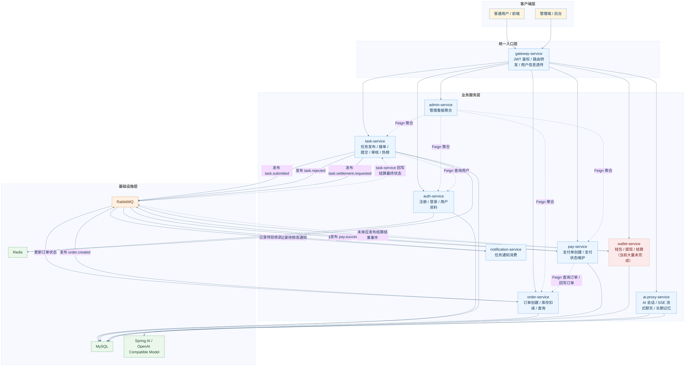
```mermaid
%%{init: {"theme":"base","themeVariables":{"fontSize":"24px","primaryTextColor":"#183C61","primaryBorderColor":"#4C8EDA","lineColor":"#507090"},"flowchart":{"htmlLabels":true,"nodeSpacing":70,"rankSpacing":95,"curve":"basis","useMaxWidth":false}}}%%
flowchart TB
    subgraph A["客户端层"]
        U1["普通用户 / 前端"]
        U2["管理端 / 后台"]
    end

    subgraph B["统一入口层"]
        GW["gateway-service<br/>JWT 鉴权 / 路由转发 / 用户信息透传"]
    end

    subgraph C["业务服务层"]
        AUTH["auth-service<br/>注册 / 登录 / 用户资料"]
        TASK["task-service<br/>任务发布 / 接单 / 提交 / 审核 / 热榜"]
        ADMIN["admin-service<br/>管理看板聚合"]
        ORDER["order-service<br/>订单创建 / 库存扣减 / 查询"]
        PAY["pay-service<br/>支付单创建 / 支付状态维护"]
        WALLET["wallet-service<br/>钱包 / 提现 / 结算（当前大量未完成）"]
        NOTICE["notification-service<br/>任务通知消费"]
        AI["ai-proxy-service<br/>AI 会话 / SSE 流式聊天 / 长期记忆"]
    end

    subgraph D["基础设施层"]
        MYSQL["MySQL"]
        REDIS["Redis"]
        MQ["RabbitMQ"]
        MODEL["Spring AI / OpenAI Compatible Model"]
    end

    U1 --> GW
    U2 --> GW

    GW --> AUTH
    GW --> TASK
    GW --> ADMIN
    GW --> ORDER
    GW --> PAY
    GW --> WALLET
    GW --> AI

    ADMIN -. "Feign 聚合" .-> AUTH
    ADMIN -. "Feign 聚合" .-> TASK
    ADMIN -. "Feign 聚合" .-> ORDER
    ADMIN -. "Feign 聚合" .-> PAY
    TASK -. "Feign 查询用户" .-> AUTH
    PAY -. "Feign 查询订单 / 回写订单" .-> ORDER

    ORDER -- "发布 order.created" --> MQ
    MQ -- "预创建支付单" --> PAY

    PAY -- "发布 pay.success" --> MQ
    MQ -- "更新订单状态" --> ORDER

    TASK -- "发布 task.submitted" --> MQ
    MQ -- "记录待验收通知" --> NOTICE

    TASK -- "发布 task.rejected" --> MQ
    MQ -- "记录待修改通知" --> NOTICE

    TASK -- "发布 task.settlement.requested" --> MQ
    MQ -- "触发钱包结算" --> WALLET

    WALLET -. "未来应发布结算结果事件" .-> MQ
    MQ -. "task-service 回写结算最终状态" .-> TASK

    AUTH --> MYSQL
    AUTH --> REDIS
    TASK --> MYSQL
    TASK --> REDIS
    ORDER --> MYSQL
    PAY --> MYSQL
    WALLET --> MYSQL
    AI --> MYSQL
    AI --> MODEL

    classDef normal fill:#EAF5FF,stroke:#4C8EDA,color:#183C61,stroke-width:1px;
    classDef infra fill:#EAF7EA,stroke:#4C9A5F,color:#1E4B28,stroke-width:1px;
    classDef mq fill:#FFF0E3,stroke:#D97A1A,color:#6A3905,stroke-width:1px;
    classDef todo fill:#FCEAEA,stroke:#C45D5D,color:#7A2020,stroke-dasharray: 5 3;
    class GW,AUTH,TASK,ADMIN,ORDER,PAY,NOTICE,AI normal;
    class MYSQL,REDIS,MODEL infra;
    class MQ mq;
    class WALLET todo;
```

## 2. 核心跨服务时序图

### 2.1 登录与鉴权

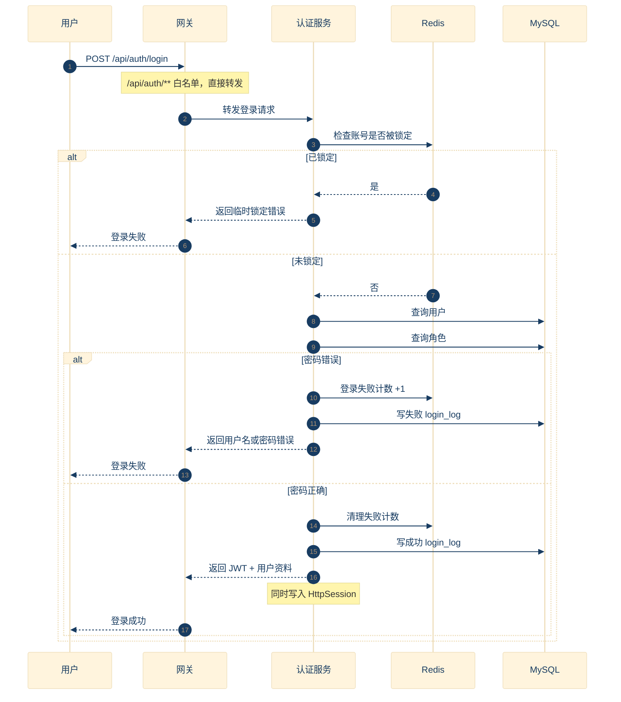
```mermaid
%%{init: {"theme":"base","themeVariables":{"fontSize":"20px","actorTextColor":"#183C61","primaryTextColor":"#183C61","lineColor":"#4F6B8A"}}}%%
sequenceDiagram
    autonumber
    participant U as 用户
    participant G as 网关
    participant A as 认证服务
    participant R as Redis
    participant M as MySQL

    U->>G: POST /api/auth/login
    Note over G: /api/auth/** 白名单，直接转发
    G->>A: 转发登录请求
    A->>R: 检查账号是否被锁定
    alt 已锁定
        R-->>A: 是
        A-->>G: 返回临时锁定错误
        G-->>U: 登录失败
    else 未锁定
        R-->>A: 否
        A->>M: 查询用户
        A->>M: 查询角色
        alt 密码错误
            A->>R: 登录失败计数 +1
            A->>M: 写失败 login_log
            A-->>G: 返回用户名或密码错误
            G-->>U: 登录失败
        else 密码正确
            A->>R: 清理失败计数
            A->>M: 写成功 login_log
            A-->>G: 返回 JWT + 用户资料
            Note over A: 同时写入 HttpSession
            G-->>U: 登录成功
        end
    end
```

### 2.2 任务提交成果

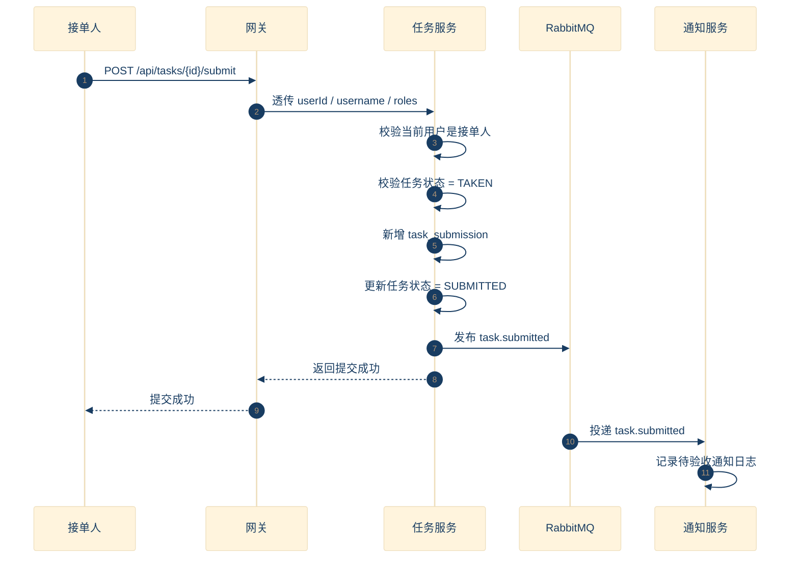
```mermaid
%%{init: {"theme":"base","themeVariables":{"fontSize":"20px","actorTextColor":"#183C61","primaryTextColor":"#183C61","lineColor":"#4F6B8A"}}}%%
sequenceDiagram
    autonumber
    participant U as 接单人
    participant G as 网关
    participant T as 任务服务
    participant Q as RabbitMQ
    participant N as 通知服务

    U->>G: POST /api/tasks/{id}/submit
    G->>T: 透传 userId / username / roles
    T->>T: 校验当前用户是接单人
    T->>T: 校验任务状态 = TAKEN
    T->>T: 新增 task_submission
    T->>T: 更新任务状态 = SUBMITTED
    T->>Q: 发布 task.submitted
    T-->>G: 返回提交成功
    G-->>U: 提交成功
    Q->>N: 投递 task.submitted
    N->>N: 记录待验收通知日志
```

### 2.3 任务审批与结算

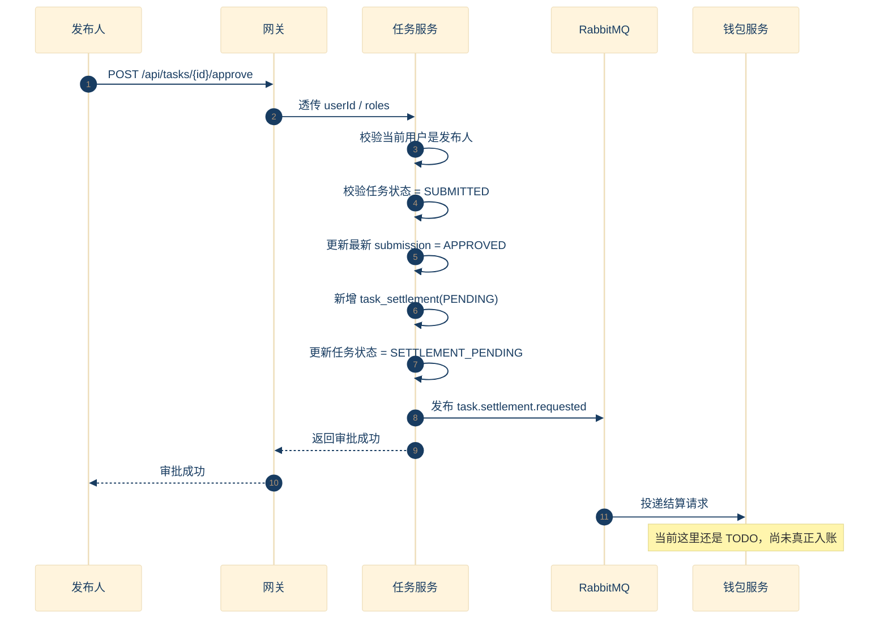
```mermaid
%%{init: {"theme":"base","themeVariables":{"fontSize":"20px","actorTextColor":"#183C61","primaryTextColor":"#183C61","lineColor":"#4F6B8A"}}}%%
sequenceDiagram
    autonumber
    participant P as 发布人
    participant G as 网关
    participant T as 任务服务
    participant Q as RabbitMQ
    participant W as 钱包服务

    P->>G: POST /api/tasks/{id}/approve
    G->>T: 透传 userId / roles
    T->>T: 校验当前用户是发布人
    T->>T: 校验任务状态 = SUBMITTED
    T->>T: 更新最新 submission = APPROVED
    T->>T: 新增 task_settlement(PENDING)
    T->>T: 更新任务状态 = SETTLEMENT_PENDING
    T->>Q: 发布 task.settlement.requested
    T-->>G: 返回审批成功
    G-->>P: 审批成功
    Q->>W: 投递结算请求
    Note over W: 当前这里还是 TODO，尚未真正入账
```

### 2.4 下单与支付

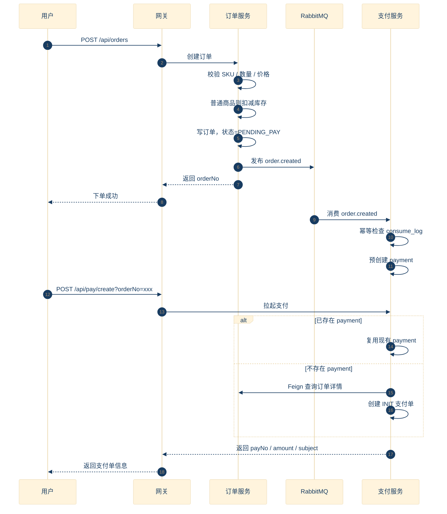
```mermaid
%%{init: {"theme":"base","themeVariables":{"fontSize":"20px","actorTextColor":"#183C61","primaryTextColor":"#183C61","lineColor":"#4F6B8A"}}}%%
sequenceDiagram
    autonumber
    participant U as 用户
    participant G as 网关
    participant O as 订单服务
    participant Q as RabbitMQ
    participant P as 支付服务

    U->>G: POST /api/orders
    G->>O: 创建订单
    O->>O: 校验 SKU / 数量 / 价格
    O->>O: 普通商品则扣减库存
    O->>O: 写订单，状态=PENDING_PAY
    O->>Q: 发布 order.created
    O-->>G: 返回 orderNo
    G-->>U: 下单成功

    Q->>P: 消费 order.created
    P->>P: 幂等检查 consume_log
    P->>P: 预创建 payment

    U->>G: POST /api/pay/create?orderNo=xxx
    G->>P: 拉起支付
    alt 已存在 payment
        P->>P: 复用现有 payment
    else 不存在 payment
        P->>O: Feign 查询订单详情
        P->>P: 创建 INIT 支付单
    end
    P-->>G: 返回 payNo / amount / subject
    G-->>U: 返回支付单信息
```

### 2.5 AI 流式聊天

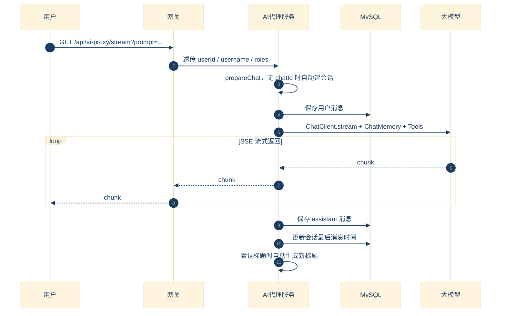
```mermaid
%%{init: {"theme":"base","themeVariables":{"fontSize":"19px","actorTextColor":"#183C61","primaryTextColor":"#183C61","lineColor":"#4F6B8A"}}}%%
sequenceDiagram
    autonumber
    participant U as 用户
    participant G as 网关
    participant A as AI代理服务
    participant M as MySQL
    participant L as 大模型

    U->>G: GET /api/ai-proxy/stream?prompt=...
    G->>A: 透传 userId / username / roles
    A->>A: prepareChat，无 chatId 时自动建会话
    A->>M: 保存用户消息
    A->>L: ChatClient.stream + ChatMemory + Tools
    loop SSE 流式返回
        L-->>A: chunk
        A-->>G: chunk
        G-->>U: chunk
    end
    A->>M: 保存 assistant 消息
    A->>M: 更新会话最后消息时间
    A->>A: 默认标题时自动生成新标题
```

## 3. gateway-service

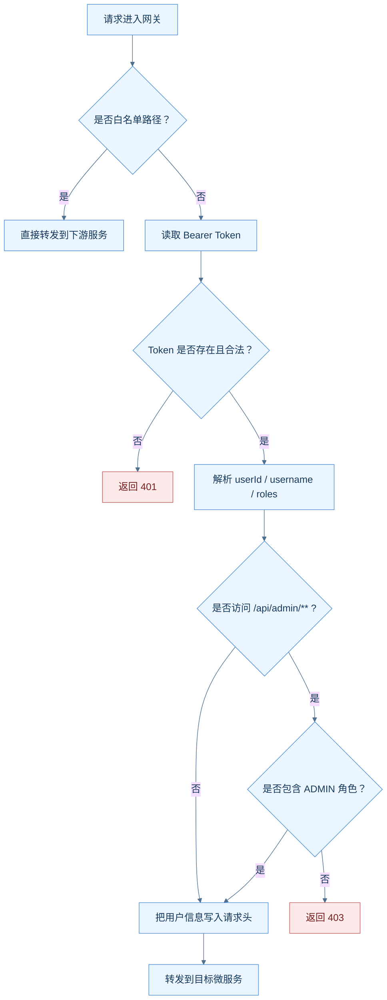
```mermaid
%%{init: {"theme":"base","themeVariables":{"fontSize":"18px","primaryTextColor":"#183C61","primaryBorderColor":"#4C8EDA","lineColor":"#507090"},"flowchart":{"htmlLabels":true,"nodeSpacing":40,"rankSpacing":58,"curve":"basis","useMaxWidth":false}}}%%
flowchart TB
    A["请求进入网关"] --> B{"是否白名单路径？"}
    B -->|是| C["直接转发到下游服务"]
    B -->|否| D["读取 Bearer Token"]
    D --> E{"Token 是否存在且合法？"}
    E -->|否| F["返回 401"]
    E -->|是| G["解析 userId / username / roles"]
    G --> H{"是否访问 /api/admin/** ?"}
    H -->|否| I["把用户信息写入请求头"]
    H -->|是| J{"是否包含 ADMIN 角色？"}
    J -->|否| K["返回 403"]
    J -->|是| I
    I --> L["转发到目标微服务"]

    classDef ok fill:#EAF5FF,stroke:#4C8EDA,color:#183C61;
    classDef err fill:#FCEAEA,stroke:#C45D5D,color:#7A2020;
    class A,B,C,D,E,G,H,I,J,L ok;
    class F,K err;
```

## 4. auth-service

### 4.1 注册流程

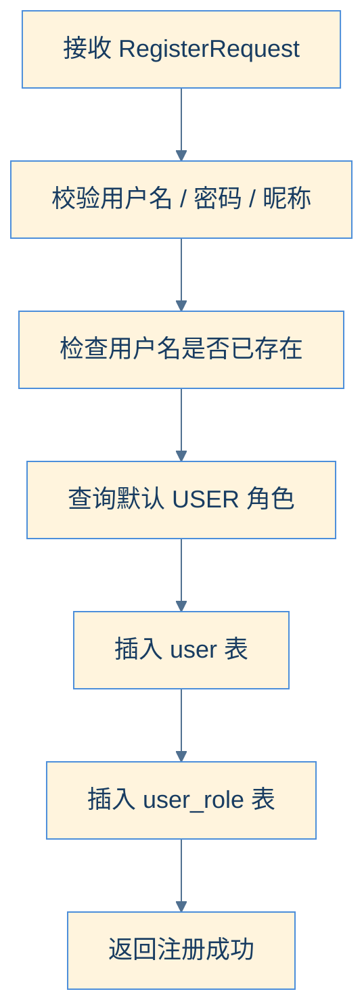
```mermaid
%%{init: {"theme":"base","themeVariables":{"fontSize":"18px","primaryTextColor":"#183C61","primaryBorderColor":"#4C8EDA","lineColor":"#507090"},"flowchart":{"htmlLabels":true,"nodeSpacing":40,"rankSpacing":54,"curve":"basis","useMaxWidth":false}}}%%
flowchart TB
    R1["接收 RegisterRequest"] --> R2["校验用户名 / 密码 / 昵称"]
    R2 --> R3["检查用户名是否已存在"]
    R3 --> R4["查询默认 USER 角色"]
    R4 --> R5["插入 user 表"]
    R5 --> R6["插入 user_role 表"]
    R6 --> R7["返回注册成功"]
```

### 4.2 登录流程

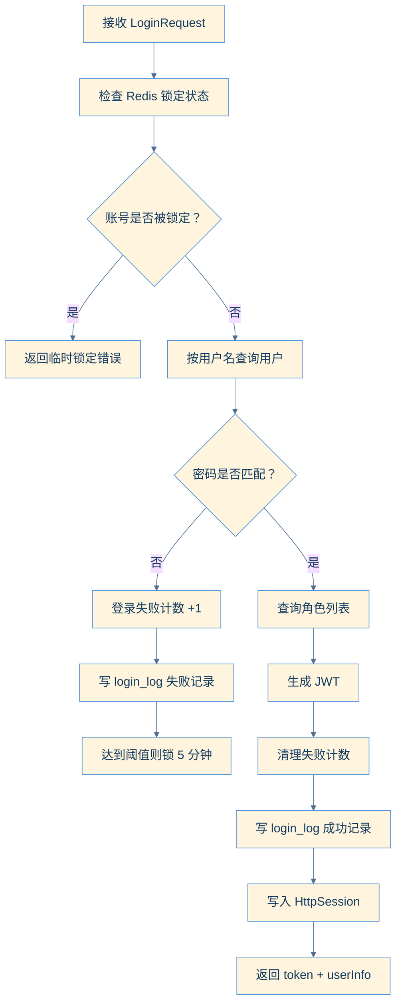
```mermaid
%%{init: {"theme":"base","themeVariables":{"fontSize":"19px","primaryTextColor":"#183C61","primaryBorderColor":"#4C8EDA","lineColor":"#507090"},"flowchart":{"htmlLabels":true,"nodeSpacing":42,"rankSpacing":56,"curve":"basis","useMaxWidth":false}}}%%
flowchart TB
    L1["接收 LoginRequest"] --> L2["检查 Redis 锁定状态"]
    L2 --> L3{"账号是否被锁定？"}
    L3 -->|是| L4["返回临时锁定错误"]
    L3 -->|否| L5["按用户名查询用户"]
    L5 --> L6{"密码是否匹配？"}
    L6 -->|否| L7["登录失败计数 +1"]
    L7 --> L8["写 login_log 失败记录"]
    L8 --> L9["达到阈值则锁 5 分钟"]
    L6 -->|是| L10["查询角色列表"]
    L10 --> L11["生成 JWT"]
    L11 --> L12["清理失败计数"]
    L12 --> L13["写 login_log 成功记录"]
    L13 --> L14["写入 HttpSession"]
    L14 --> L15["返回 token + userInfo"]
```

### 4.3 内部接口

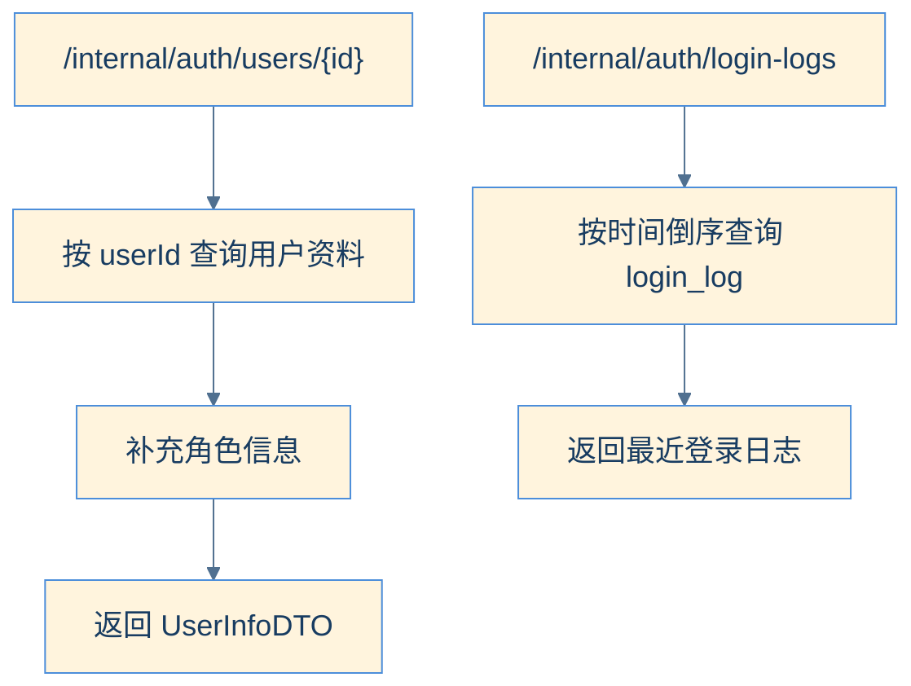
```mermaid
%%{init: {"theme":"base","themeVariables":{"fontSize":"18px","primaryTextColor":"#183C61","primaryBorderColor":"#4C8EDA","lineColor":"#507090"},"flowchart":{"htmlLabels":true,"nodeSpacing":36,"rankSpacing":50,"curve":"basis","useMaxWidth":false}}}%%
flowchart TB
    I1["/internal/auth/users/{id}"] --> I2["按 userId 查询用户资料"]
    I2 --> I3["补充角色信息"]
    I3 --> I4["返回 UserInfoDTO"]

    J1["/internal/auth/login-logs"] --> J2["按时间倒序查询 login_log"]
    J2 --> J3["返回最近登录日志"]
```

## 5. task-service

### 5.1 任务状态生命周期

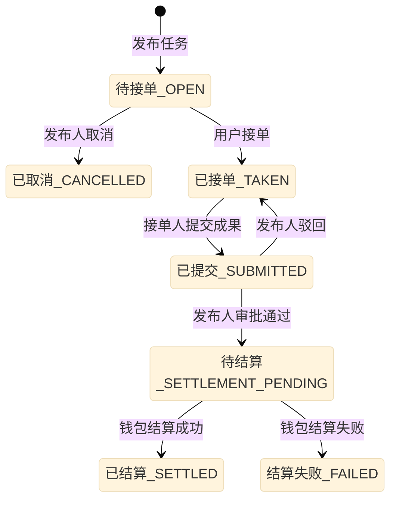
```mermaid
%%{init: {"theme":"base","themeVariables":{"fontSize":"19px"}}}%%
stateDiagram-v2
    [*] --> 待接单_OPEN: 发布任务
    待接单_OPEN --> 已取消_CANCELLED: 发布人取消
    待接单_OPEN --> 已接单_TAKEN: 用户接单
    已接单_TAKEN --> 已提交_SUBMITTED: 接单人提交成果
    已提交_SUBMITTED --> 已接单_TAKEN: 发布人驳回
    已提交_SUBMITTED --> 待结算_SETTLEMENT_PENDING: 发布人审批通过
    待结算_SETTLEMENT_PENDING --> 已结算_SETTLED: 钱包结算成功
    待结算_SETTLEMENT_PENDING --> 结算失败_FAILED: 钱包结算失败
```

### 5.2 发布任务

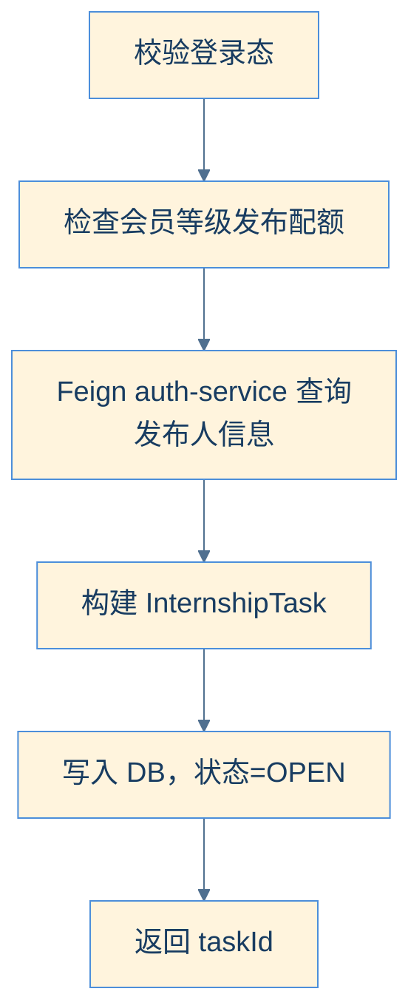
```mermaid
%%{init: {"theme":"base","themeVariables":{"fontSize":"19px","primaryTextColor":"#183C61","primaryBorderColor":"#4C8EDA","lineColor":"#507090"},"flowchart":{"htmlLabels":true,"nodeSpacing":42,"rankSpacing":56,"curve":"basis","useMaxWidth":false}}}%%
flowchart TB
    C1["校验登录态"] --> C2["检查会员等级发布配额"]
    C2 --> C3["Feign auth-service 查询发布人信息"]
    C3 --> C4["构建 InternshipTask"]
    C4 --> C5["写入 DB，状态=OPEN"]
    C5 --> C6["返回 taskId"]
```

### 5.3 任务查询与热榜

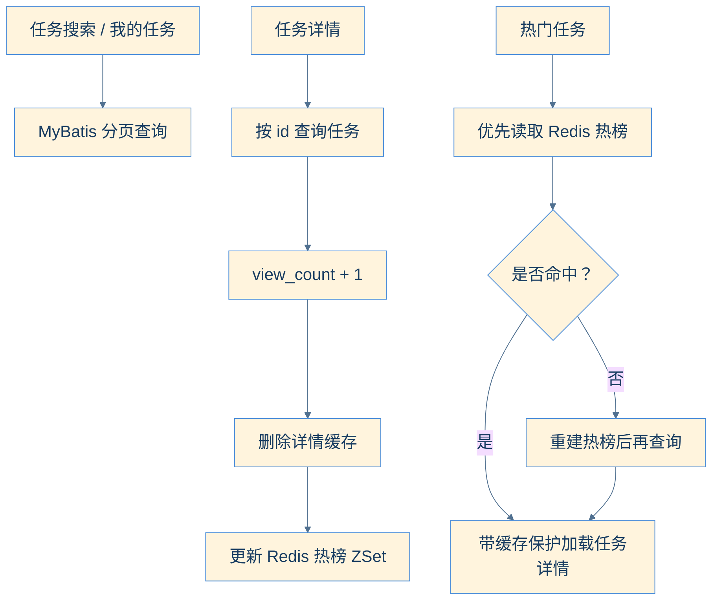
```mermaid
%%{init: {"theme":"base","themeVariables":{"fontSize":"21px","primaryTextColor":"#183C61","primaryBorderColor":"#4C8EDA","lineColor":"#507090"},"flowchart":{"htmlLabels":true,"nodeSpacing":52,"rankSpacing":68,"curve":"basis","useMaxWidth":false}}}%%
flowchart TB
    A1["任务搜索 / 我的任务"] --> A2["MyBatis 分页查询"]

    B1["任务详情"] --> B2["按 id 查询任务"]
    B2 --> B3["view_count + 1"]
    B3 --> B4["删除详情缓存"]
    B4 --> B5["更新 Redis 热榜 ZSet"]

    C1["热门任务"] --> C2["优先读取 Redis 热榜"]
    C2 --> C3{"是否命中？"}
    C3 -->|是| C4["带缓存保护加载任务详情"]
    C3 -->|否| C5["重建热榜后再查询"]
    C5 --> C4
```

### 5.4 接单与取消

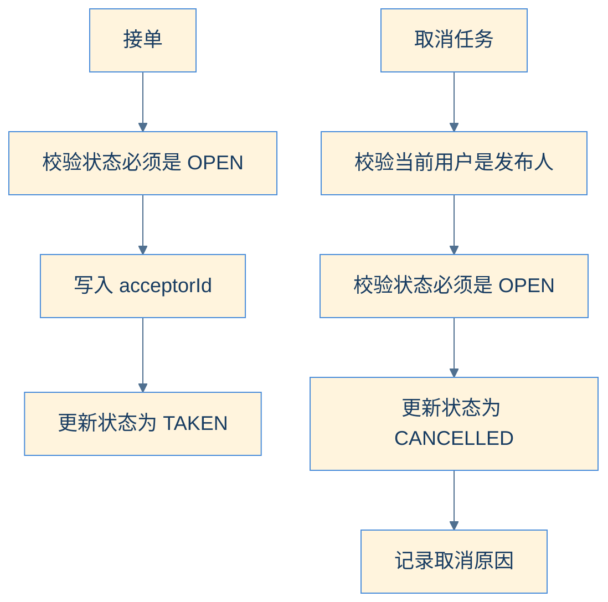
```mermaid
%%{init: {"theme":"base","themeVariables":{"fontSize":"18px","primaryTextColor":"#183C61","primaryBorderColor":"#4C8EDA","lineColor":"#507090"},"flowchart":{"htmlLabels":true,"nodeSpacing":40,"rankSpacing":54,"curve":"basis","useMaxWidth":false}}}%%
flowchart TB
    T1["接单"] --> T2["校验状态必须是 OPEN"]
    T2 --> T3["写入 acceptorId"]
    T3 --> T4["更新状态为 TAKEN"]

    X1["取消任务"] --> X2["校验当前用户是发布人"]
    X2 --> X3["校验状态必须是 OPEN"]
    X3 --> X4["更新状态为 CANCELLED"]
    X4 --> X5["记录取消原因"]
```

### 5.5 提交成果

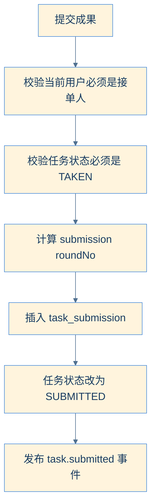
```mermaid
%%{init: {"theme":"base","themeVariables":{"fontSize":"19px","primaryTextColor":"#183C61","primaryBorderColor":"#4C8EDA","lineColor":"#507090"},"flowchart":{"htmlLabels":true,"nodeSpacing":42,"rankSpacing":56,"curve":"basis","useMaxWidth":false}}}%%
flowchart TB
    S1["提交成果"] --> S2["校验当前用户必须是接单人"]
    S2 --> S3["校验任务状态必须是 TAKEN"]
    S3 --> S4["计算 submission roundNo"]
    S4 --> S5["插入 task_submission"]
    S5 --> S6["任务状态改为 SUBMITTED"]
    S6 --> S7["发布 task.submitted 事件"]
```

### 5.6 驳回成果

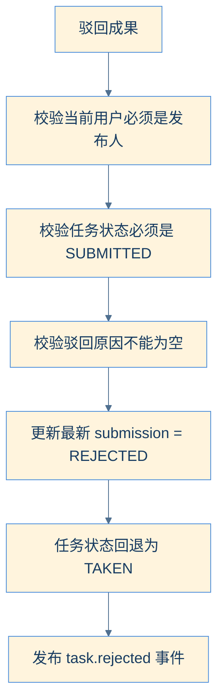
```mermaid
%%{init: {"theme":"base","themeVariables":{"fontSize":"19px","primaryTextColor":"#183C61","primaryBorderColor":"#4C8EDA","lineColor":"#507090"},"flowchart":{"htmlLabels":true,"nodeSpacing":42,"rankSpacing":56,"curve":"basis","useMaxWidth":false}}}%%
flowchart TB
    R1["驳回成果"] --> R2["校验当前用户必须是发布人"]
    R2 --> R3["校验任务状态必须是 SUBMITTED"]
    R3 --> R4["校验驳回原因不能为空"]
    R4 --> R5["更新最新 submission = REJECTED"]
    R5 --> R6["任务状态回退为 TAKEN"]
    R6 --> R7["发布 task.rejected 事件"]
```

### 5.7 审批通过与发起结算

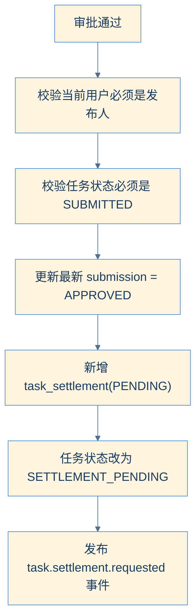
```mermaid
%%{init: {"theme":"base","themeVariables":{"fontSize":"19px","primaryTextColor":"#183C61","primaryBorderColor":"#4C8EDA","lineColor":"#507090"},"flowchart":{"htmlLabels":true,"nodeSpacing":42,"rankSpacing":56,"curve":"basis","useMaxWidth":false}}}%%
flowchart TB
    P1["审批通过"] --> P2["校验当前用户必须是发布人"]
    P2 --> P3["校验任务状态必须是 SUBMITTED"]
    P3 --> P4["更新最新 submission = APPROVED"]
    P4 --> P5["新增 task_settlement(PENDING)"]
    P5 --> P6["任务状态改为 SETTLEMENT_PENDING"]
    P6 --> P7["发布 task.settlement.requested 事件"]
```

### 5.8 结算结果回写

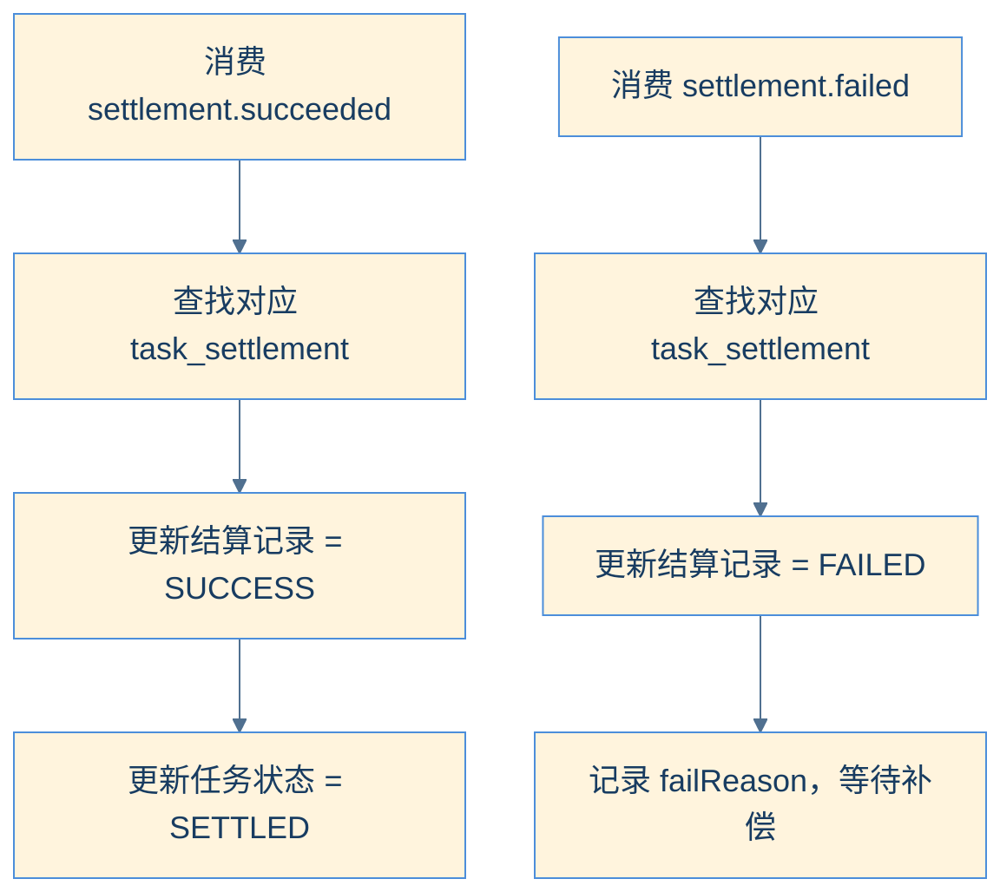
```mermaid
%%{init: {"theme":"base","themeVariables":{"fontSize":"18px","primaryTextColor":"#183C61","primaryBorderColor":"#4C8EDA","lineColor":"#507090"},"flowchart":{"htmlLabels":true,"nodeSpacing":40,"rankSpacing":54,"curve":"basis","useMaxWidth":false}}}%%
flowchart TB
    M1["消费 settlement.succeeded"] --> M2["查找对应 task_settlement"]
    M2 --> M3["更新结算记录 = SUCCESS"]
    M3 --> M4["更新任务状态 = SETTLED"]

    N1["消费 settlement.failed"] --> N2["查找对应 task_settlement"]
    N2 --> N3["更新结算记录 = FAILED"]
    N3 --> N4["记录 failReason，等待补偿"]
```

## 6. admin-service

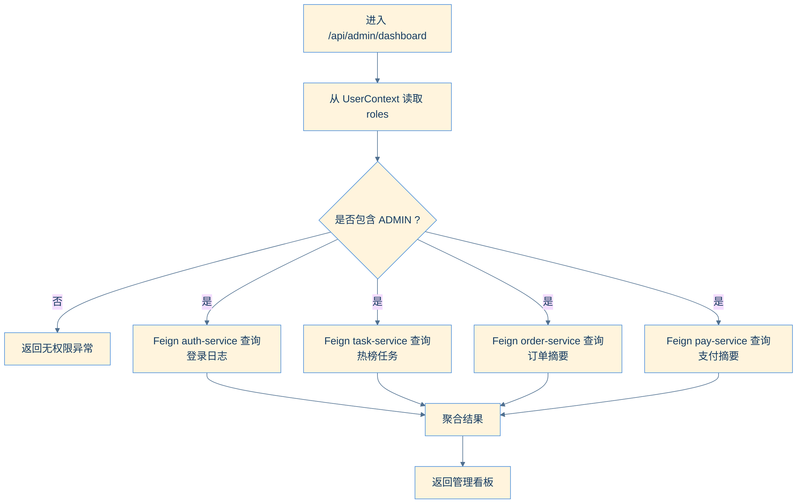
```mermaid
%%{init: {"theme":"base","themeVariables":{"fontSize":"18px","primaryTextColor":"#183C61","primaryBorderColor":"#4C8EDA","lineColor":"#507090"},"flowchart":{"htmlLabels":true,"nodeSpacing":40,"rankSpacing":54,"curve":"basis","useMaxWidth":false}}}%%
flowchart TB
    A1["进入 /api/admin/dashboard"] --> A2["从 UserContext 读取 roles"]
    A2 --> A3{"是否包含 ADMIN ?"}
    A3 -->|否| A4["返回无权限异常"]
    A3 -->|是| A5["Feign auth-service 查询登录日志"]
    A3 -->|是| A6["Feign task-service 查询热榜任务"]
    A3 -->|是| A7["Feign order-service 查询订单摘要"]
    A3 -->|是| A8["Feign pay-service 查询支付摘要"]
    A5 --> A9["聚合结果"]
    A6 --> A9
    A7 --> A9
    A8 --> A9
    A9 --> A10["返回管理看板"]
```

## 7. order-service

### 7.1 订单状态

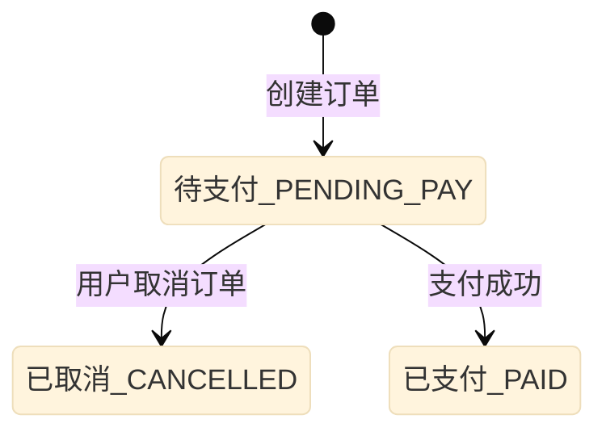
```mermaid
%%{init: {"theme":"base","themeVariables":{"fontSize":"18px"}}}%%
stateDiagram-v2
    [*] --> 待支付_PENDING_PAY: 创建订单
    待支付_PENDING_PAY --> 已取消_CANCELLED: 用户取消订单
    待支付_PENDING_PAY --> 已支付_PAID: 支付成功
```

### 7.2 创建订单

```mermaid
%%{init: {"theme":"base","themeVariables":{"fontSize":"19px","primaryTextColor":"#183C61","primaryBorderColor":"#4C8EDA","lineColor":"#507090"},"flowchart":{"htmlLabels":true,"nodeSpacing":42,"rankSpacing":56,"curve":"basis","useMaxWidth":false}}}%%
flowchart TB
    O1["接收 CreateOrderRequest"] --> O2["校验 SKU / 数量 / 金额"]
    O2 --> O3{"是否会员商品？"}
    O3 -->|是| O4["校验会员价格与数量"]
    O3 -->|否| O5["扣减库存"]
    O4 --> O6["创建订单，状态=PENDING_PAY"]
    O5 --> O6
    O6 --> O7["发布 order.created"]
```

### 7.3 查询与取消

```mermaid
%%{init: {"theme":"base","themeVariables":{"fontSize":"18px","primaryTextColor":"#183C61","primaryBorderColor":"#4C8EDA","lineColor":"#507090"},"flowchart":{"htmlLabels":true,"nodeSpacing":40,"rankSpacing":54,"curve":"basis","useMaxWidth":false}}}%%
flowchart TB
    Q1["/api/orders/mine"] --> Q2["按 userId 查询订单列表"]
    Q3["/api/orders/{orderNo}"] --> Q4["按 orderNo 查询订单详情"]

    C1["取消订单"] --> C2["校验当前用户是订单所有者"]
    C2 --> C3["校验状态必须是 PENDING_PAY"]
    C3 --> C4["更新状态 = CANCELLED"]
    C4 --> C5{"是否普通商品？"}
    C5 -->|是| C6["恢复库存"]
    C5 -->|否| C7["无需恢复库存"]
```

### 7.4 支付回写

```mermaid
%%{init: {"theme":"base","themeVariables":{"fontSize":"18px","primaryTextColor":"#183C61","primaryBorderColor":"#4C8EDA","lineColor":"#507090"},"flowchart":{"htmlLabels":true,"nodeSpacing":40,"rankSpacing":54,"curve":"basis","useMaxWidth":false}}}%%
flowchart TB
    P1["内部接口 /mark-paid"] --> P2["更新订单状态 = PAID"]

    M1["消费 pay.success"] --> M2["幂等校验"]
    M2 --> M3["更新订单状态 = PAID"]

    F1["消费 pay.fail"] --> F2["当前仍是 TODO 占位逻辑"]
```

## 8. pay-service

### 8.1 支付状态

```mermaid
%%{init: {"theme":"base","themeVariables":{"fontSize":"18px"}}}%%
stateDiagram-v2
    [*] --> INIT: 主动拉起支付时创建
    [*] --> PENDING: 消费 order.created 时预创建
    INIT --> SUCCESS: 支付成功
    PENDING --> SUCCESS: 支付成功
    INIT --> CLOSED: 手动关闭
    PENDING --> CLOSED: 手动关闭
```

### 8.2 预创建支付单

```mermaid
%%{init: {"theme":"base","themeVariables":{"fontSize":"18px","primaryTextColor":"#183C61","primaryBorderColor":"#4C8EDA","lineColor":"#507090"},"flowchart":{"htmlLabels":true,"nodeSpacing":40,"rankSpacing":54,"curve":"basis","useMaxWidth":false}}}%%
flowchart TB
    M1["消费 order.created"] --> M2["检查 consume_log 幂等"]
    M2 --> M3{"是否已经消费过？"}
    M3 -->|是| M4["直接忽略"]
    M3 -->|否| M5["若 payment 不存在则创建支付单"]
    M5 --> M6["写入 consume_log"]
```

### 8.3 用户拉起支付

```mermaid
%%{init: {"theme":"base","themeVariables":{"fontSize":"18px","primaryTextColor":"#183C61","primaryBorderColor":"#4C8EDA","lineColor":"#507090"},"flowchart":{"htmlLabels":true,"nodeSpacing":40,"rankSpacing":54,"curve":"basis","useMaxWidth":false}}}%%
flowchart TB
    U1["/api/pay/create?orderNo"] --> U2["按 orderNo 查询 payment"]
    U2 --> U3{"payment 是否存在？"}
    U3 -->|是| U4["复用现有 payment"]
    U3 -->|否| U5["Feign order-service 查询订单详情"]
    U5 --> U6["校验订单状态 = PENDING_PAY"]
    U6 --> U7["创建 INIT 支付单"]
    U4 --> U8["返回 payNo / amount / subject"]
    U7 --> U8
```

### 8.4 查询 / 关闭 / 支付成功

```mermaid
%%{init: {"theme":"base","themeVariables":{"fontSize":"18px","primaryTextColor":"#183C61","primaryBorderColor":"#4C8EDA","lineColor":"#507090"},"flowchart":{"htmlLabels":true,"nodeSpacing":40,"rankSpacing":54,"curve":"basis","useMaxWidth":false}}}%%
flowchart TB
    Q1["/api/pay/{orderNo}"] --> Q2["查询支付详情"]

    C1["/api/pay/{orderNo}/close"] --> C2["校验支付单尚未成功"]
    C2 --> C3["更新状态 = CLOSED"]

    S1["mockPaySuccess（仅 service 中存在）"] --> S2["更新 payment = SUCCESS"]
    S2 --> S3["Feign order-service markPaid"]
    S3 --> S4["Feign order-service detail"]
    S4 --> S5["发布 pay.success"]
```

## 9. wallet-service

### 9.1 用户与管理接口总览

```mermaid
%%{init: {"theme":"base","themeVariables":{"fontSize":"19px","primaryTextColor":"#183C61","primaryBorderColor":"#4C8EDA","lineColor":"#507090"},"flowchart":{"htmlLabels":true,"nodeSpacing":42,"rankSpacing":56,"curve":"basis","useMaxWidth":false}}}%%
flowchart TB
    U1["/api/wallet/me"] --> U2["查询钱包概览"]
    U3["/api/wallet/flows"] --> U4["查询流水分页"]
    U5["/api/wallet/withdraw"] --> U6["申请提现"]
    U7["/api/wallet/withdraws"] --> U8["查询个人提现记录"]

    A1["/api/admin/wallet/user/{userId}"] --> A2["查看指定用户钱包"]
    A3["/api/admin/wallet/withdraws"] --> A4["查看全部提现单"]
    A5["/api/admin/wallet/withdraw/{id}/approve"] --> A6["审核通过"]
    A7["/api/admin/wallet/withdraw/{id}/reject"] --> A8["审核拒绝"]

    T1["以上服务方法当前大多直接抛 UnsupportedOperationException"]
    U2 --> T1
    U4 --> T1
    U6 --> T1
    U8 --> T1
    A2 --> T1
    A4 --> T1
    A6 --> T1
    A8 --> T1

    classDef todo fill:#FCEAEA,stroke:#C45D5D,color:#7A2020,stroke-dasharray: 5 3;
    class T1 todo;
```

### 9.2 任务结算入口

```mermaid
%%{init: {"theme":"base","themeVariables":{"fontSize":"18px","primaryTextColor":"#183C61","primaryBorderColor":"#4C8EDA","lineColor":"#507090"},"flowchart":{"htmlLabels":true,"nodeSpacing":40,"rankSpacing":54,"curve":"basis","useMaxWidth":false}}}%%
flowchart TB
    S1["消费 task.settlement.requested"] --> S2["调用 WalletSettlementService.handleTaskSettlementRequested"]
    S2 --> S3["理论上应执行余额入账 / 写流水 / 发布结算结果事件"]
    S3 --> S4["当前实现仍是 TODO，未真正完成结算"]

    classDef todo fill:#FCEAEA,stroke:#C45D5D,color:#7A2020,stroke-dasharray: 5 3;
    class S4 todo;
```

## 10. notification-service

### 10.1 任务提交通知

```mermaid
%%{init: {"theme":"base","themeVariables":{"fontSize":"18px","primaryTextColor":"#183C61","primaryBorderColor":"#4C8EDA","lineColor":"#507090"},"flowchart":{"htmlLabels":true,"nodeSpacing":40,"rankSpacing":54,"curve":"basis","useMaxWidth":false}}}%%
flowchart TB
    N1["消费 task.submitted"] --> N2["校验事件完整性"]
    N2 --> N3["记录待验收通知日志"]
    N3 --> N4["预留：站内信 / 邮件 / 短信"]
```

### 10.2 任务驳回通知

```mermaid
%%{init: {"theme":"base","themeVariables":{"fontSize":"18px","primaryTextColor":"#183C61","primaryBorderColor":"#4C8EDA","lineColor":"#507090"},"flowchart":{"htmlLabels":true,"nodeSpacing":40,"rankSpacing":54,"curve":"basis","useMaxWidth":false}}}%%
flowchart TB
    N1["消费 task.rejected"] --> N2["校验事件完整性"]
    N2 --> N3["记录待修改通知日志"]
    N3 --> N4["预留：站内信 / 邮件 / 短信"]
```

## 11. ai-proxy-service

### 11.1 会话管理

```mermaid
%%{init: {"theme":"base","themeVariables":{"fontSize":"18px","primaryTextColor":"#183C61","primaryBorderColor":"#4C8EDA","lineColor":"#507090"},"flowchart":{"htmlLabels":true,"nodeSpacing":40,"rankSpacing":54,"curve":"basis","useMaxWidth":false}}}%%
flowchart TB
    S1["创建会话 /api/ai-proxy/session"] --> S2["插入 ai_session"]
    S3["查询会话列表 / 历史消息"] --> S4["当前多数接口返回空列表"]

    classDef todo fill:#FCEAEA,stroke:#C45D5D,color:#7A2020,stroke-dasharray: 5 3;
    class S4 todo;
```

### 11.2 长期记忆

```mermaid
%%{init: {"theme":"base","themeVariables":{"fontSize":"18px","primaryTextColor":"#183C61","primaryBorderColor":"#4C8EDA","lineColor":"#507090"},"flowchart":{"htmlLabels":true,"nodeSpacing":40,"rankSpacing":54,"curve":"basis","useMaxWidth":false}}}%%
flowchart TB
    M1["查询记忆 / 会话记忆"] --> M2["当前多数接口返回空列表"]
    M3["新增 / 编辑 / 删除记忆"] --> M4["当前仍是 TODO"]
    M5["切换会话记忆选中状态"] --> M6["当前仍是 TODO"]

    classDef todo fill:#FCEAEA,stroke:#C45D5D,color:#7A2020,stroke-dasharray: 5 3;
    class M2,M4,M6 todo;
```

### 11.3 流式聊天

```mermaid
%%{init: {"theme":"base","themeVariables":{"fontSize":"19px","primaryTextColor":"#183C61","primaryBorderColor":"#4C8EDA","lineColor":"#507090"},"flowchart":{"htmlLabels":true,"nodeSpacing":42,"rankSpacing":56,"curve":"basis","useMaxWidth":false}}}%%
flowchart TB
    C1["prepareChat"] --> C2{"chatId 是否存在？"}
    C2 -->|是| C3["校验会话归属"]
    C2 -->|否| C4["创建默认标题 New Chat 会话"]
    C3 --> C5["保存用户消息"]
    C4 --> C5
    C5 --> C6["调用 ChatClient.stream"]
    C6 --> C7["挂载 ChatMemory"]
    C7 --> C8["挂载 TaskOpsTools"]
    C8 --> C9["流式返回大模型输出"]
    C9 --> C10["保存 assistant 消息"]
    C10 --> C11["更新 session.lastMessageAt"]
    C11 --> C12["必要时自动生成标题"]
```

## 12. 当前最关键的未完成点

- `wallet-service` 还没有把“结算请求 -> 钱包入账 -> 发布结算结果 -> task-service 回写最终状态”真正打通。
- `pay-service` 已经有 `mockPaySuccess` 业务逻辑，但没有控制器入口，不方便本地完整演示支付成功闭环。
- `notification-service` 目前只是日志通知，没有真实站内信、短信、邮件发送。
- `ai-proxy-service` 的会话历史、长期记忆、记忆开关还没有彻底补完。

## 13. 如果你还嫌小，下一步我可以直接这样处理

- 给你再拆成多个独立文件：`docs/flows/task.md`、`docs/flows/order.md`、`docs/flows/pay.md` 等，每个文件只保留一个服务。
- 或者我直接给你生成一套更适合展示的 SVG / HTML 页面，一张图单独一页。