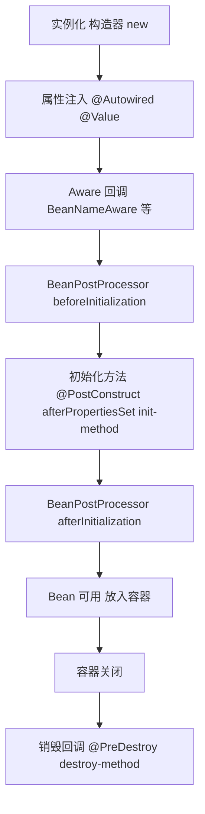

# Bean 生命周期与注入结果示例

## 1. Bean 生命周期（常见顺序）



结论：默认情况下，A 注入 B 时，B 通常已经初始化完成（或被代理后可用）。

---

## 2. 不同注入方式，注入进去的是什么

### 示例实体

```java
public interface PayService {
    void pay();
}

@Service
public class PayServiceImpl implements PayService {
    @PostConstruct
    public void init() {
        System.out.println("PayServiceImpl init");
    }
    @Override
    public void pay() {}
}
```

### 2.1 构造器注入（推荐）

```java
@Service
public class OrderService {
    private final PayService payService;

    public OrderService(PayService payService) {
        this.payService = payService;
    }
}
```

注入结果：
1. 类型上是 `PayService`
2. 实际对象通常是 `PayServiceImpl`（若有 AOP 可能是代理）

### 2.2 字段注入

```java
@Service
public class OrderService2 {
    @Autowired
    private PayService payService;
}
```

注入结果与构造器注入本质相同，只是注入时机是“实例化后、初始化前”。

### 2.3 Setter 注入

```java
@Service
public class OrderService3 {
    private PayService payService;

    @Autowired
    public void setPayService(PayService payService) {
        this.payService = payService;
    }
}
```

适合可选依赖或后续替换依赖。

### 2.4 方法参数注入（普通方法）

```java
@Component
public class StartupTask {
    @Autowired
    public void runAtStartup(PayService payService) {
        // 方法参数也可由 Spring 注入
    }
}
```

### 2.5 `@Bean` 方法参数注入

```java
@Configuration
public class AppConfig {
    @Bean
    public BizFacade bizFacade(PayService payService) {
        return new BizFacade(payService);
    }
}
```

`@Bean` 方法参数同样由容器解析并注入。

---

## 3. “注入的是类还是执行结果？”

要分两层看：

1. 注入的是“对象引用”（Bean），不是某个方法返回值缓存（除非你自己这么设计）
2. 该对象通常已经执行过初始化（如 `@PostConstruct`）

也就是说：注入进去的是“初始化后的 Bean 对象”。

---

## 4. 有 AOP 时，拿到的可能是代理类

如果 `PayService` 上有事务、切面等，注入对象可能是代理。

```java
System.out.println(payService.getClass().getName());
```

可能输出类似：
1. `com.sun.proxy.$Proxy...`（JDK 动态代理）
2. `xxx$$EnhancerBySpringCGLIB...`（CGLIB）

这不影响你按接口调用方法，但说明你拿到的是“代理 Bean”。

---

## 5. 关键问答（对应你的问题）

1. Spring 会优先执行被注入对象吗？  
会。依赖 Bean 先创建并初始化，当前 Bean 才能注入成功。

2. 注入时拿到的是执行后的结果吗？  
通常是“初始化后的 Bean”。如果是代理场景，拿到的是“初始化后的代理对象”。

3. 方法注入和类注入有区别吗？  
本质都是容器按类型解析依赖；区别主要在写法和时机（构造器/字段/Setter/方法参数）。
