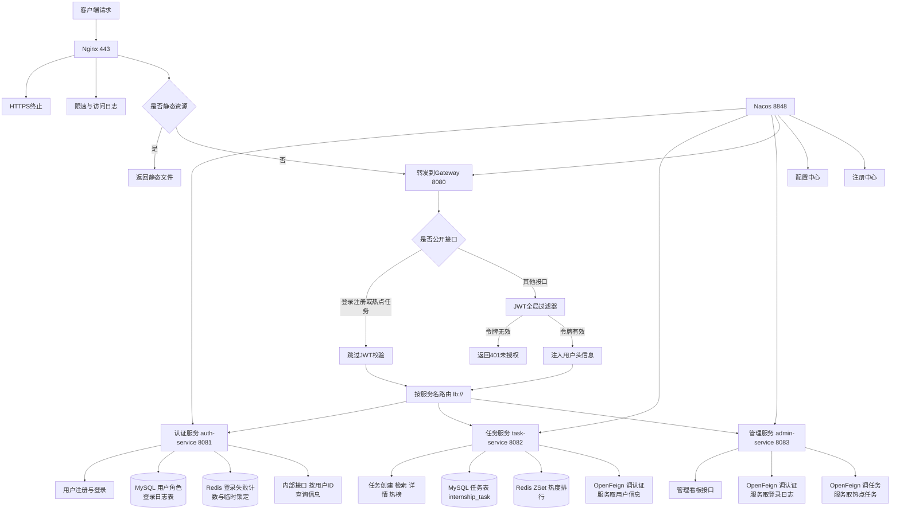

# TaskOps Cloud 中文流程图（Nginx -> Gateway）

```mermaid
%%{init: {'theme':'default','themeVariables': {'fontSize': '24px'}, 'flowchart': {'nodeSpacing': 65, 'rankSpacing': 85}} }%%
flowchart TD
    A[客户端请求] --> N1[Nginx 443]
    N1 --> N2[HTTPS终止]
    N1 --> N3[限速与访问日志]
    N1 --> N4{是否静态资源}
    N4 -->|是| N5[返回静态文件]
    N4 -->|否| B[转发到Gateway 8080]

    B --> C{是否公开接口}
    C -->|登录注册或热点任务| D[跳过JWT校验]
    C -->|其他接口| E[JWT全局过滤器]
    E -->|令牌无效| F[返回401未授权]
    E -->|令牌有效| G[注入用户头信息]

    D --> H[按服务名路由 lb://]
    G --> H

    H --> I[认证服务 auth-service 8081]
    H --> J[任务服务 task-service 8082]
    H --> K[管理服务 admin-service 8083]

    I --> I1[用户注册与登录]
    I --> I2[(MySQL 用户角色登录日志表)]
    I --> I3[(Redis 登录失败计数与临时锁定)]
    I --> I4[内部接口 按用户ID查询信息]

    J --> J1[任务创建 检索 详情 热榜]
    J --> J2[(MySQL 任务表 internship_task)]
    J --> J3[(Redis ZSet 热度排行)]
    J --> J4[OpenFeign 调认证服务取用户信息]

    K --> K1[管理看板接口]
    K --> K2[OpenFeign 调认证服务取登录日志]
    K --> K3[OpenFeign 调任务服务取热点任务]

    X[Nacos 8848] --> I
    X --> J
    X --> K
    X --> B
    X --> X1[配置中心]
    X --> X2[注册中心]
```
