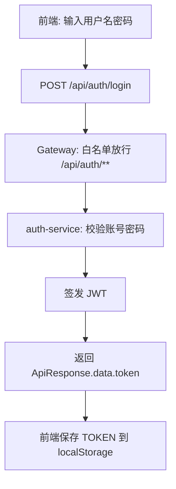
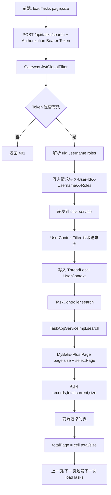

# 登录鉴权与任务分页流程图

## 1) 登录与 Token 下发

## 2) 受保护接口访问（以任务搜索为例）

## 3) 关键说明

- Token 校验在 Gateway 做，微服务通常不再手动 `request.getToken()`。
- 微服务通过 `UserContext` 获取当前用户信息（来源于网关透传请求头）。
- 分页参数由前端传 `page/size`，后端返回 `records/total`，前端再计算总页数。
