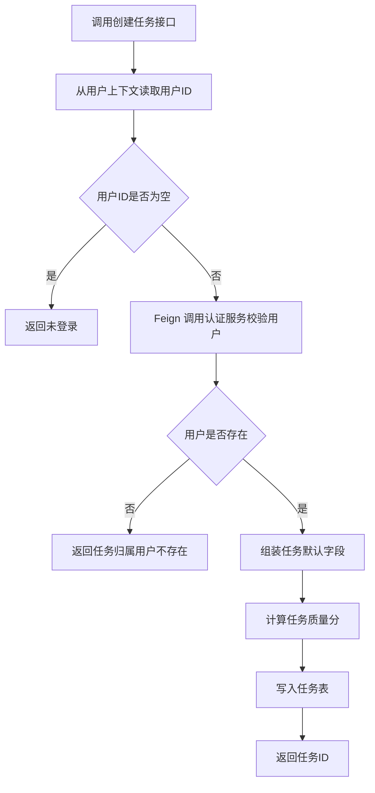
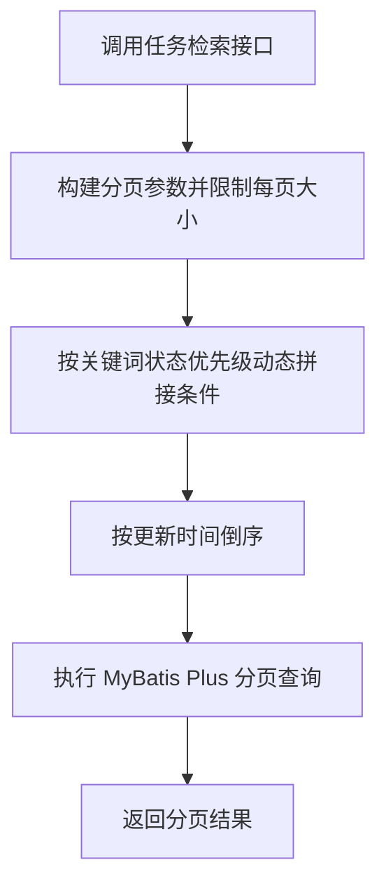
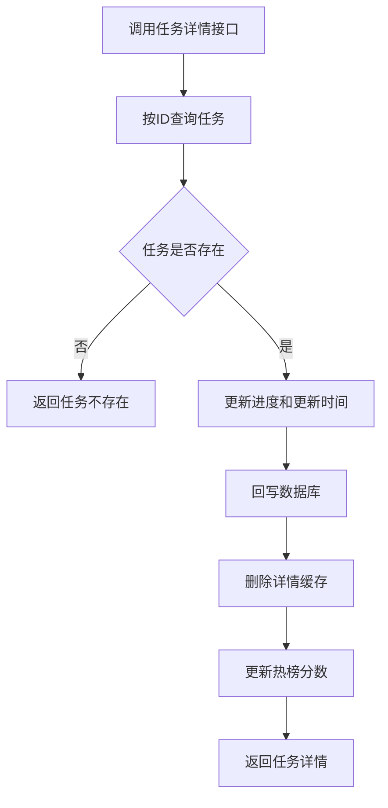
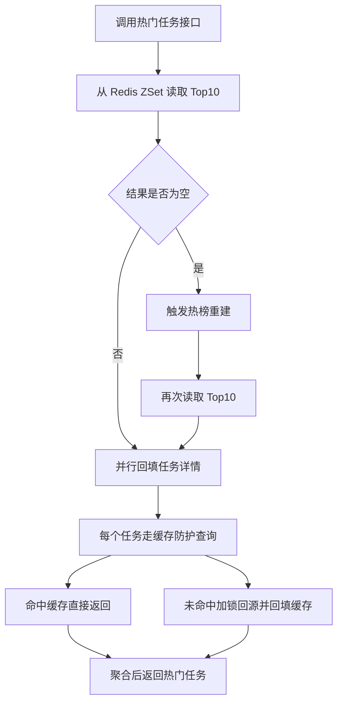
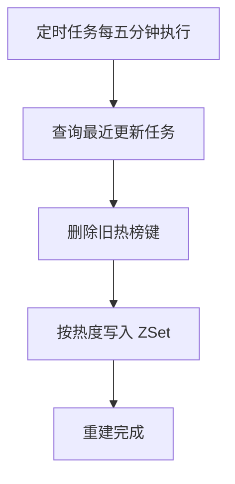

# task-service 流程图

## 创建任务流程

```mermaid
graph TD
    A[调用创建任务接口] --> B[从用户上下文读取用户ID]
    B --> C{用户ID是否为空}
    C -- 是 --> C1[返回未登录]
    C -- 否 --> D[Feign 调用认证服务校验用户]
    D --> E{用户是否存在}
    E -- 否 --> E1[返回任务归属用户不存在]
    E -- 是 --> F[组装任务默认字段]
    F --> G[计算任务质量分]
    G --> H[写入任务表]
    H --> I[返回任务ID]
```

## 分页检索流程

```mermaid
graph TD
    A[调用任务检索接口] --> B[构建分页参数并限制每页大小]
    B --> C[按关键词状态优先级动态拼接条件]
    C --> D[按更新时间倒序]
    D --> E[执行 MyBatis Plus 分页查询]
    E --> F[返回分页结果]
```

## 任务详情流程

```mermaid
graph TD
    A[调用任务详情接口] --> B[按ID查询任务]
    B --> C{任务是否存在}
    C -- 否 --> C1[返回任务不存在]
    C -- 是 --> D[更新进度和更新时间]
    D --> E[回写数据库]
    E --> F[删除详情缓存]
    F --> G[更新热榜分数]
    G --> H[返回任务详情]
```

## 热门任务流程

```mermaid
graph TD
    A[调用热门任务接口] --> B[从 Redis ZSet 读取 Top10]
    B --> C{结果是否为空}
    C -- 是 --> D[触发热榜重建]
    D --> E[再次读取 Top10]
    C -- 否 --> F[并行回填任务详情]
    E --> F
    F --> G[每个任务走缓存防护查询]
    G --> H[命中缓存直接返回]
    G --> I[未命中加锁回源并回填缓存]
    H --> J[聚合后返回热门任务]
    I --> J
```

## 定时重建流程

```mermaid
graph TD
    A[定时任务每五分钟执行] --> B[查询最近更新任务]
    B --> C[删除旧热榜键]
    C --> D[按热度写入 ZSet]
    D --> E[重建完成]
```

