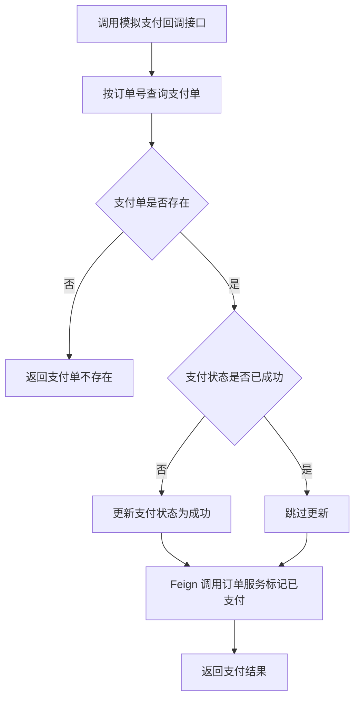
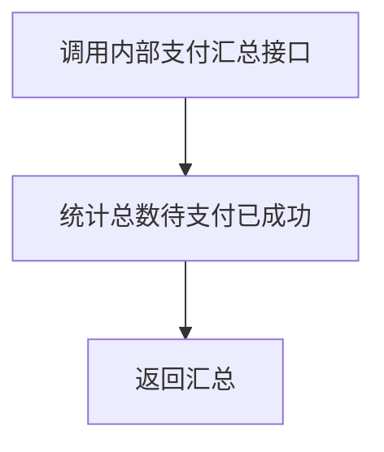
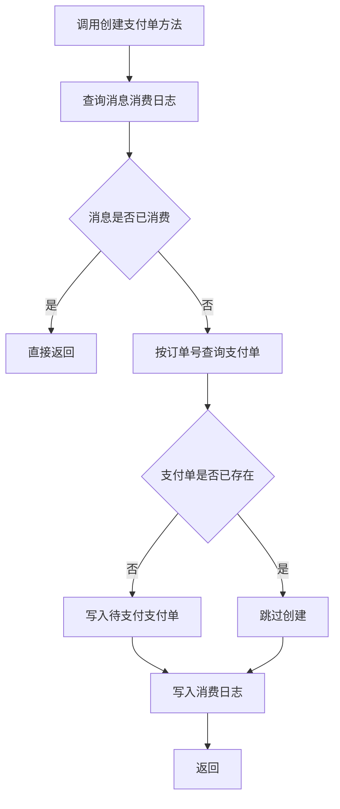

# pay-service 流程图

## 模拟支付回调流程

```mermaid
graph TD
    A[调用模拟支付回调接口] --> B[按订单号查询支付单]
    B --> C{支付单是否存在}
    C -- 否 --> C1[返回支付单不存在]
    C -- 是 --> D{支付状态是否已成功}
    D -- 否 --> E[更新支付状态为成功]
    D -- 是 --> F[跳过更新]
    E --> G[Feign 调用订单服务标记已支付]
    F --> G
    G --> H[返回支付结果]
```

## 支付汇总流程

```mermaid
graph TD
    A[调用内部支付汇总接口] --> B[统计总数待支付已成功]
    B --> C[返回汇总]
```

## 幂等创建支付单流程

```mermaid
graph TD
    A[调用创建支付单方法] --> B[查询消息消费日志]
    B --> C{消息是否已消费}
    C -- 是 --> C1[直接返回]
    C -- 否 --> D[按订单号查询支付单]
    D --> E{支付单是否已存在}
    E -- 否 --> F[写入待支付支付单]
    E -- 是 --> G[跳过创建]
    F --> H[写入消费日志]
    G --> H
    H --> I[返回]
```

