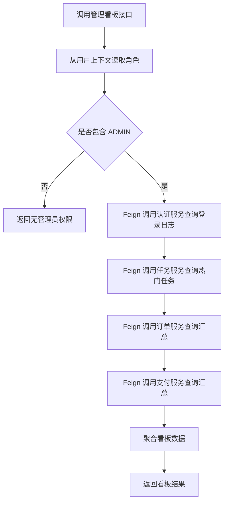

# admin-service 流程图

```mermaid
graph TD
    A[调用管理看板接口] --> B[从用户上下文读取角色]
    B --> C{是否包含 ADMIN}
    C -- 否 --> C1[返回无管理员权限]
    C -- 是 --> D[Feign 调用认证服务查询登录日志]
    D --> E[Feign 调用任务服务查询热门任务]
    E --> F[Feign 调用订单服务查询汇总]
    F --> G[Feign 调用支付服务查询汇总]
    G --> H[聚合看板数据]
    H --> I[返回看板结果]
```

