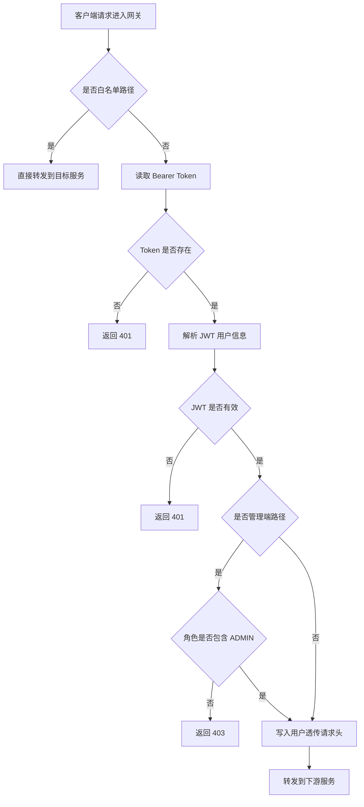

# gateway-service 流程图

```mermaid
graph TD
    A[客户端请求进入网关] --> B{是否白名单路径}
    B -- 是 --> C[直接转发到目标服务]
    B -- 否 --> D[读取 Bearer Token]
    D --> E{Token 是否存在}
    E -- 否 --> E1[返回 401]
    E -- 是 --> F[解析 JWT 用户信息]
    F --> G{JWT 是否有效}
    G -- 否 --> G1[返回 401]
    G -- 是 --> H{是否管理端路径}
    H -- 是 --> I{角色是否包含 ADMIN}
    I -- 否 --> I1[返回 403]
    I -- 是 --> J[写入用户透传请求头]
    H -- 否 --> J
    J --> K[转发到下游服务]
```

