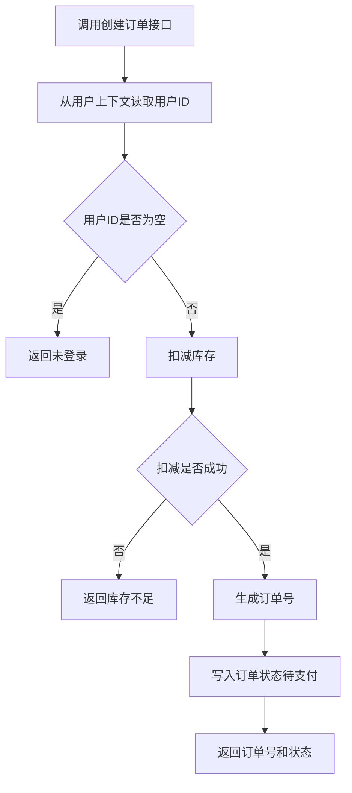
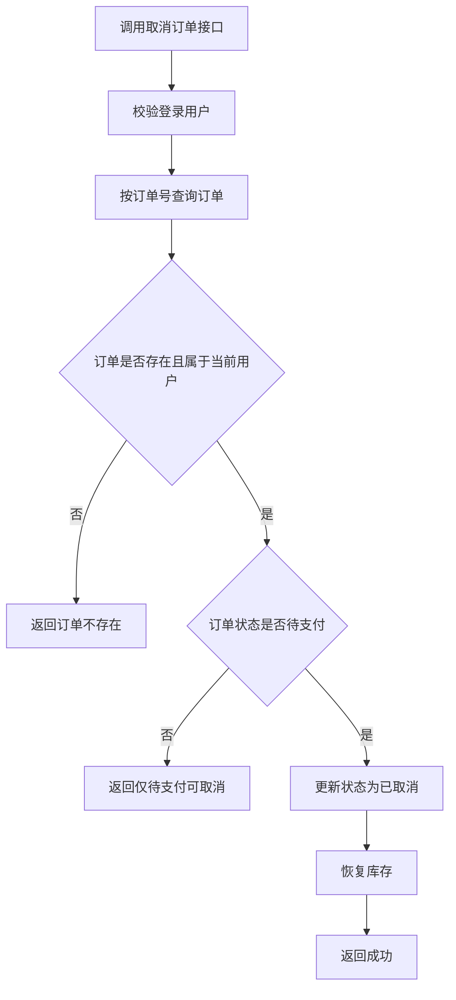
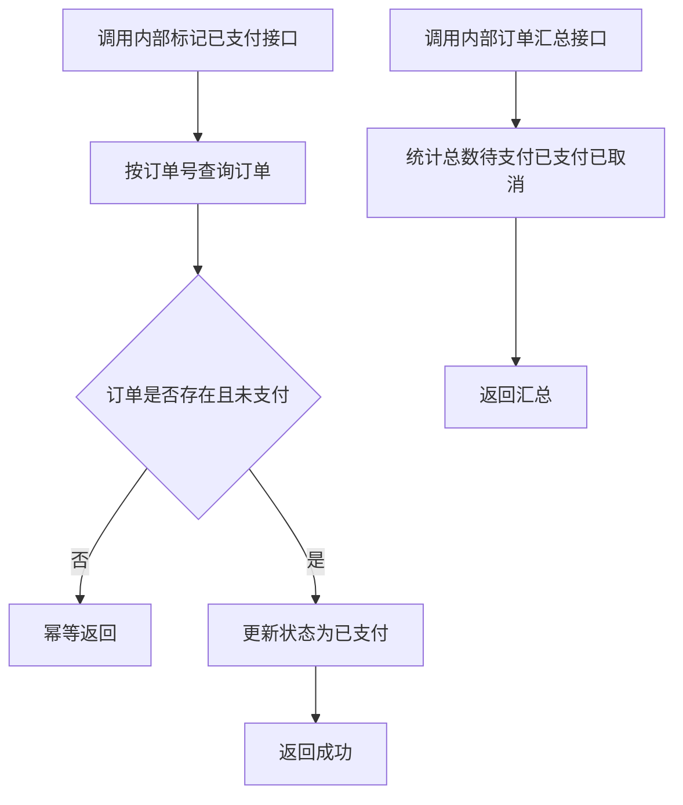

# order-service 流程图

## 创建订单流程

```mermaid
graph TD
    A[调用创建订单接口] --> B[从用户上下文读取用户ID]
    B --> C{用户ID是否为空}
    C -- 是 --> C1[返回未登录]
    C -- 否 --> D[扣减库存]
    D --> E{扣减是否成功}
    E -- 否 --> E1[返回库存不足]
    E -- 是 --> F[生成订单号]
    F --> G[写入订单状态待支付]
    G --> H[返回订单号和状态]
```

## 取消订单流程

```mermaid
graph TD
    A[调用取消订单接口] --> B[校验登录用户]
    B --> C[按订单号查询订单]
    C --> D{订单是否存在且属于当前用户}
    D -- 否 --> D1[返回订单不存在]
    D -- 是 --> E{订单状态是否待支付}
    E -- 否 --> E1[返回仅待支付可取消]
    E -- 是 --> F[更新状态为已取消]
    F --> G[恢复库存]
    G --> H[返回成功]
```

## 内部接口流程

```mermaid
graph TD
    A1[调用内部标记已支付接口] --> B1[按订单号查询订单]
    B1 --> C1{订单是否存在且未支付}
    C1 -- 否 --> D1[幂等返回]
    C1 -- 是 --> E1[更新状态为已支付]
    E1 --> F1[返回成功]

    A2[调用内部订单汇总接口] --> B2[统计总数待支付已支付已取消]
    B2 --> C2[返回汇总]
```

