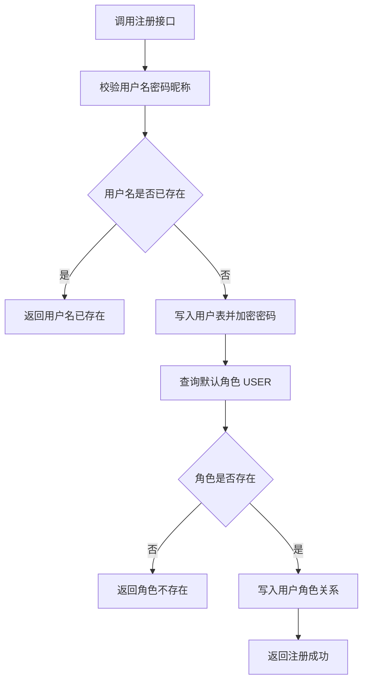
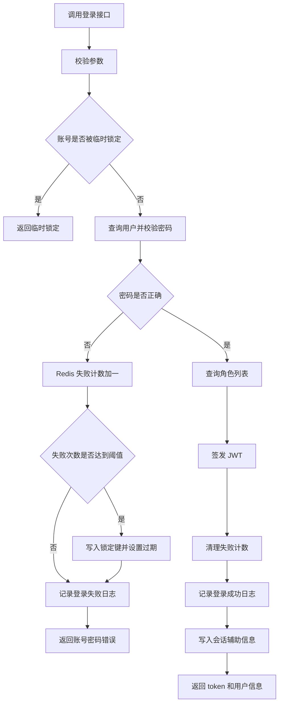
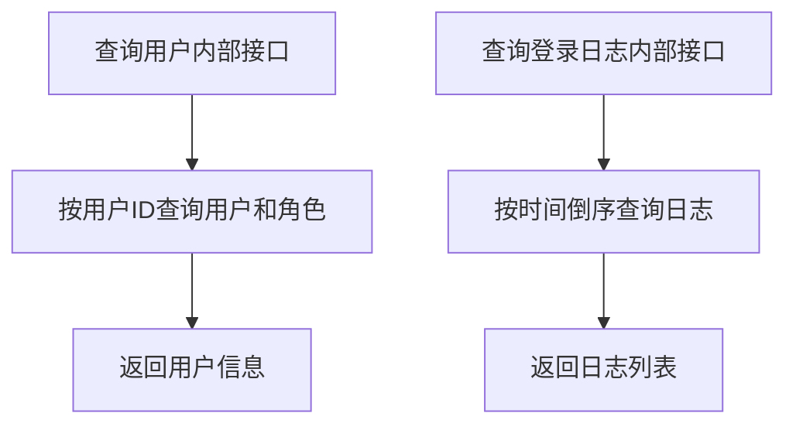

# auth-service 流程图

## 注册流程

```mermaid
graph TD
    A[调用注册接口] --> B[校验用户名密码昵称]
    B --> C{用户名是否已存在}
    C -- 是 --> C1[返回用户名已存在]
    C -- 否 --> D[写入用户表并加密密码]
    D --> E[查询默认角色 USER]
    E --> F{角色是否存在}
    F -- 否 --> F1[返回角色不存在]
    F -- 是 --> G[写入用户角色关系]
    G --> H[返回注册成功]
```

## 登录流程

```mermaid
graph TD
    A[调用登录接口] --> B[校验参数]
    B --> C{账号是否被临时锁定}
    C -- 是 --> C1[返回临时锁定]
    C -- 否 --> D[查询用户并校验密码]
    D --> E{密码是否正确}
    E -- 否 --> F[Redis 失败计数加一]
    F --> G{失败次数是否达到阈值}
    G -- 是 --> H[写入锁定键并设置过期]
    G -- 否 --> I[记录登录失败日志]
    H --> I
    I --> J[返回账号密码错误]
    E -- 是 --> K[查询角色列表]
    K --> L[签发 JWT]
    L --> M[清理失败计数]
    M --> N[记录登录成功日志]
    N --> O[写入会话辅助信息]
    O --> P[返回 token 和用户信息]
```

## 内部接口流程

```mermaid
graph TD
    A1[查询用户内部接口] --> B1[按用户ID查询用户和角色]
    B1 --> C1[返回用户信息]

    A2[查询登录日志内部接口] --> B2[按时间倒序查询日志]
    B2 --> C2[返回日志列表]
```

