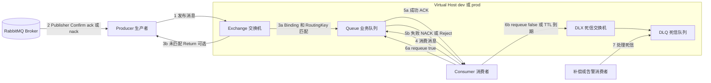

# RabbitMQ 核心组件调用流程图

```mermaid
flowchart LR
    P[Producer 生产者] -->|1 发布消息| EX[Exchange 交换机]
    B[(RabbitMQ Broker)] -->|2 Publisher Confirm ack 或 nack| P

    EX -->|3a Binding 和 RoutingKey 匹配| Q1[Queue 业务队列]
    EX -->|3b 未匹配 Return 可选| P

    C[Consumer 消费者] -->|4 消费消息| Q1
    Q1 -->|5a 成功 ACK| C
    Q1 -->|5b 失败 NACK 或 Reject| C

    C -->|6a requeue true| Q1
    C -->|6b requeue false 或 TTL 到期| DLX[DLX 死信交换机]
    DLX --> DLQ[DLQ 死信队列]
    C2[补偿或告警消费者] -->|7 处理死信| DLQ

    subgraph VHost[Virtual Host dev 或 prod]
      EX
      Q1
      DLX
      DLQ
    end
```

最简主链路：`Producer -> Exchange -> Queue -> Consumer -> ACK 或 NACK -> 失败进入 DLX 和 DLQ`。
