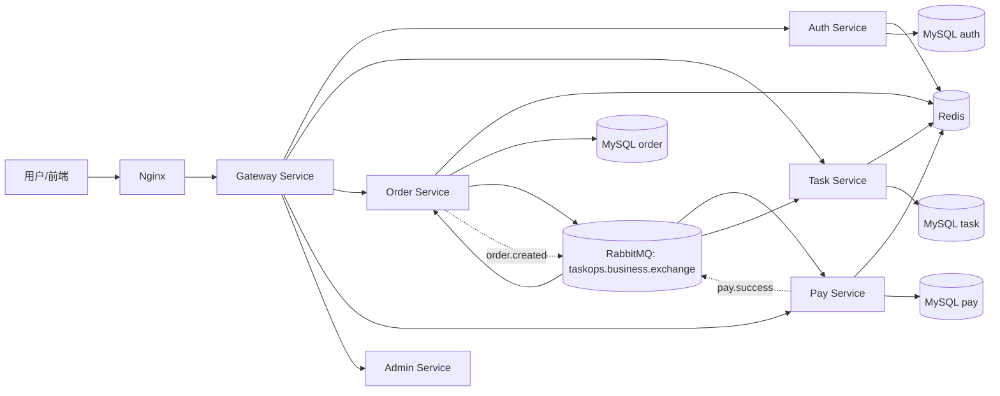
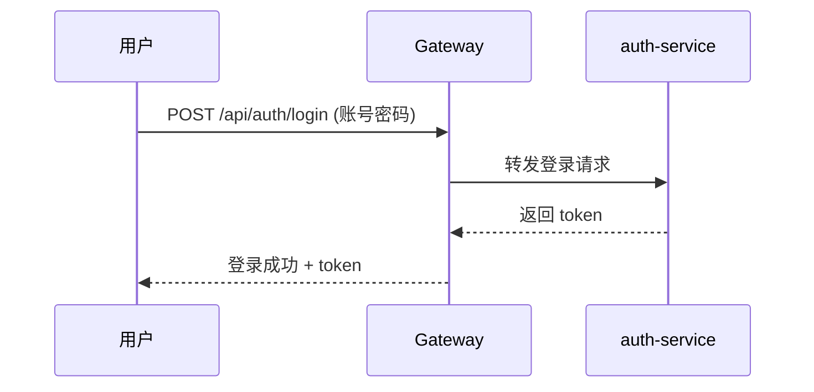
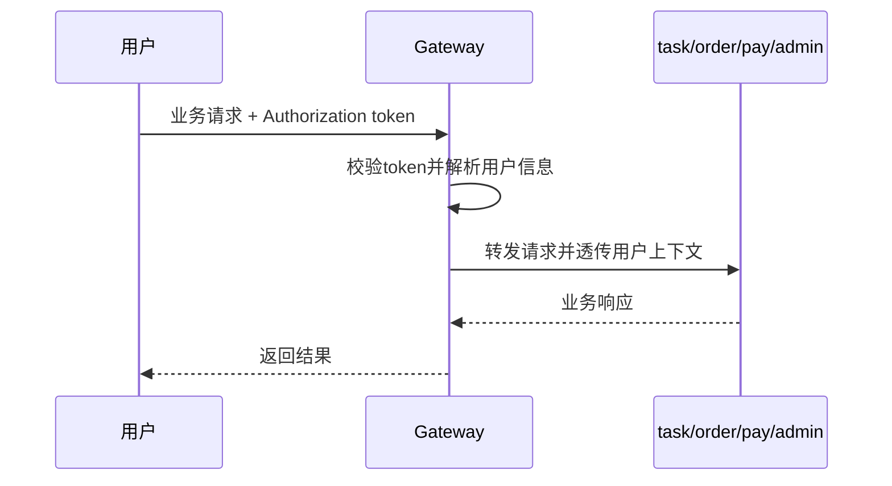
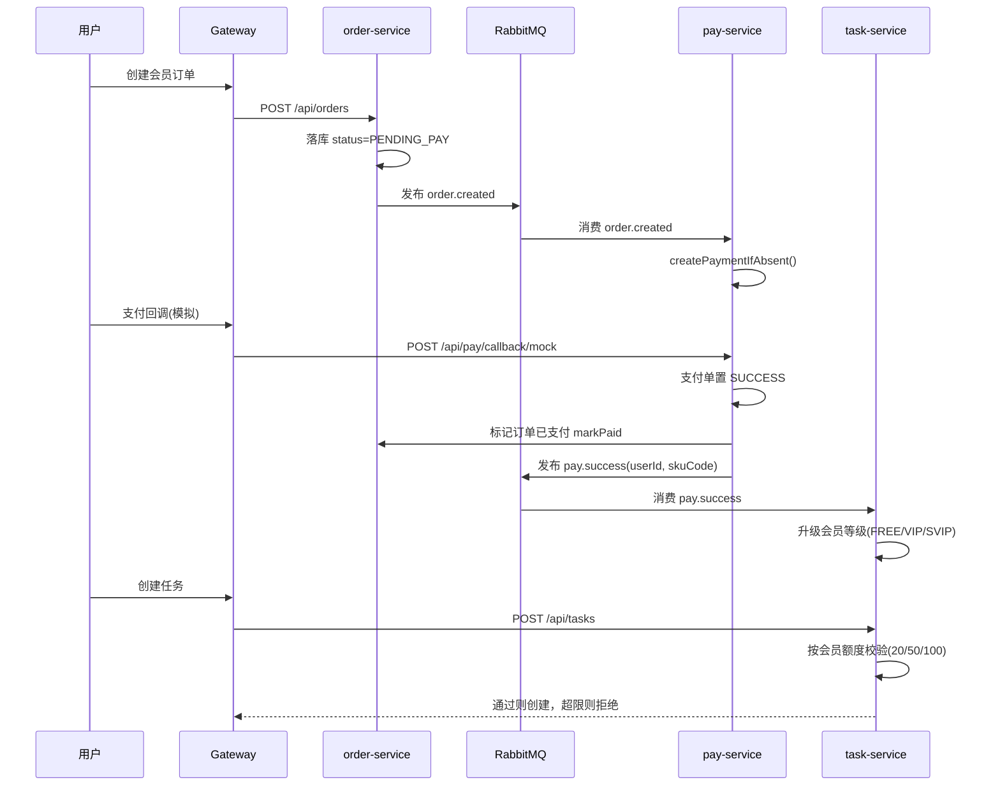
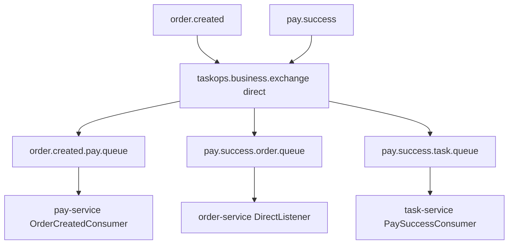

# TaskOps Cloud 项目整体流程图（复习版）

## 1) 系统总览（服务关系 + MQ）

## 2) 登录与鉴权主链路（先登录，再访问业务）

## 3) 会员付费主链路（当前改造后）

## 4) 关键事件与队列

## 5) 当前项目的业务定位

- 任务系统是核心域：`task-service`
- 订单/支付是支撑域：用于购买会员权益
- MQ用于服务解耦和异步通知，不直接替代业务规则
